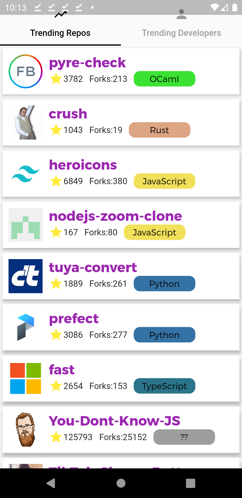
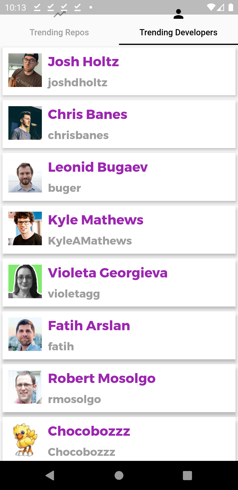

# Github trending app

Flutter github trending app with github api

# Youtube
* Full Youtube tutorial is available at my channel: https://youtu.be/Z9ZL_FBAEXQ
## Features

* Users can see trending developers
* Users can see treding repos
* They see the repos with stars, language tag, forks e.t.c
* Users can click on it and go to the repo

## Screenshots
  

